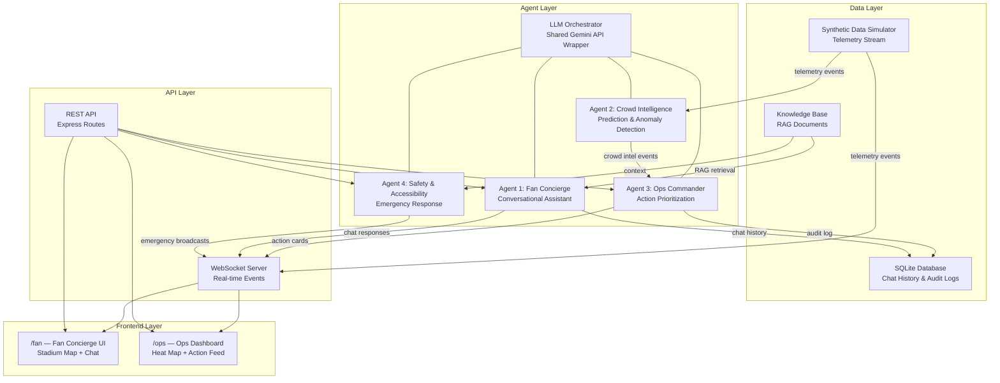

# ArenaMind — Architecture

## Overview

ArenaMind is a GenAI-powered multi-agent operations layer for FIFA World Cup 2026 stadiums. It serves two audiences from one shared intelligence core:

1. **Fans** — a real-time conversational concierge for wayfinding, seating, food, schedules, and accessibility support.
2. **Stadium Operations Staff** — a live command dashboard that turns real-time signals into prioritized, actionable recommendations.

The key insight: **fan experience and stadium operations are the same problem viewed from two sides.** A crowd bottleneck is simultaneously a fan-experience failure and an ops failure. ArenaMind solves both with one underlying system.

---

## System Architecture



---

## Four Cooperating Agents

All four agents share one **LLM Orchestrator** module — a single clean API wrapper (`agents/orchestrator.ts`) with agent-specific system prompts stored as separate config files under `/prompts/`. This eliminates code duplication and ensures consistent error handling, tracing, and graceful degradation.

### Agent 1 — Fan Concierge

| Attribute | Detail |
|-----------|--------|
| **Scope** | Conversational assistant for fans |
| **Input** | Text/voice chat messages |
| **Output** | Grounded responses (wayfinding, schedules, food, accessibility) |
| **Grounding** | RAG over knowledge base (venue policies, gate maps, menus, FAQs) |
| **Languages** | English, Spanish, French, Arabic |
| **Accessibility** | Simplified-language mode, screen-reader-optimized mode |

### Agent 2 — Crowd Intelligence

| Attribute | Detail |
|-----------|--------|
| **Scope** | Real-time crowd analytics and prediction |
| **Input** | Synthetic telemetry stream (turnstile counts, queue lengths, occupancy) |
| **Output** | Structured events: `{ zone_id, risk_level, eta_to_threshold, recommended_action }` |
| **Method** | Rule-based heuristics simulating a production ML model (clearly documented) |
| **Prediction** | 15–30 minute horizon via linear trend extrapolation |

### Agent 3 — Ops Commander

| Attribute | Detail |
|-----------|--------|
| **Scope** | Staff-facing action prioritization |
| **Input** | Crowd Intelligence events + live alerts |
| **Output** | Prioritized action cards with reasoning chains |
| **Interaction** | Staff accept/dismiss/snooze → logged to audit trail |
| **Transparency** | Every recommendation shows triggering signals and confidence |

### Agent 4 — Safety & Accessibility

| Attribute | Detail |
|-----------|--------|
| **Scope** | Emergency response and accessible communication |
| **Input** | Panic button triggers, emergency escalations |
| **Output** | Multi-language, multi-format emergency broadcasts |
| **Formats** | Standard, large-text, simplified-language, screen-reader versions |
| **Always-on** | Separate entry point from general concierge chat |

---

## Data Flow

### Fan Experience Path
```
Fan sends message → REST API → Fan Concierge Agent
                                    ↓
                              RAG Knowledge Base lookup
                                    ↓
                              LLM Orchestrator (Gemini)
                                    ↓
                              Streamed response → WebSocket → Fan UI
```

### Operations Path
```
Simulator emits telemetry → WebSocket broadcast
                                ↓
                          Crowd Intelligence Agent
                          (rolling window analysis,
                           trend extrapolation,
                           anomaly detection)
                                ↓
                          Structured CrowdIntelEvent
                                ↓
                          Ops Commander Agent
                          (prioritization, action generation,
                           LLM reasoning enrichment)
                                ↓
                          ActionCard → WebSocket → Ops Dashboard
                          + Agent Trace → WebSocket → Trace Panel
```

### Emergency Path
```
Panic button → REST API → Safety & Accessibility Agent
                                ↓
                          Multi-language broadcast generation
                          (4 languages × 3 formats = 12 variants)
                                ↓
                          WebSocket broadcast → All connected clients
                          + Ops notification → Ops Dashboard
```

---

## Data Layer

### Synthetic Data Simulator

The simulator generates realistic telemetry events following match-phase patterns:

| Phase | Duration | Behavior |
|-------|----------|----------|
| Pre-match | T-90 to T-0 | Gates ramp 10% → 85% capacity |
| First half | 45 min | Steady state, low concession activity |
| Halftime | 15 min | Concession queues 3×, restroom spikes |
| Second half | 45 min | Return to steady state |
| Post-match | 30 min | Exit gates hit 95%+ capacity |

**Anomaly injection** simulates real-world incidents (gate malfunction, medical alert) to exercise the Crowd Intelligence detection pipeline.

> **Production note:** In a production system, this simulator would be replaced by real IoT integrations — turnstile APIs, camera-based crowd counting (computer vision), point-of-sale systems, and BMS (Building Management System) feeds. The WebSocket event schema is designed to be compatible with such integrations.

### Knowledge Base (RAG)

Static documents indexed at startup using TF-IDF similarity search:
- Venue policies, gate maps, concession menus
- Accessibility services, FAQs, zone graph
- No external vector database dependency

### SQLite Database

Lightweight persistence for:
- Chat message history (per session, no PII beyond session scope)
- Ops action audit log (staff role, not identity)

---

## Module Boundaries

```
arenamind/
├── packages/backend/
│   ├── src/
│   │   ├── agents/       # All four agents + shared orchestrator
│   │   ├── simulator/    # Synthetic data engine, patterns, anomalies
│   │   ├── api/          # Express routes, middleware, WebSocket handlers
│   │   ├── rag/          # Knowledge base loader, retrieval engine
│   │   ├── db/           # SQLite schema and data access layer
│   │   └── types/        # Shared TypeScript interfaces
│   ├── prompts/          # Versioned agent system prompts (markdown)
│   └── knowledge-base/   # RAG source documents (JSON)
├── packages/frontend/
│   └── src/
│       ├── components/
│       │   ├── shared/   # StadiumMap, AgentTrace, LanguageSwitcher
│       │   ├── fan/      # Fan concierge UI components
│       │   └── ops/      # Ops dashboard components
│       ├── hooks/        # WebSocket, chat, simulator hooks
│       ├── contexts/     # React contexts (WebSocket, Accessibility)
│       └── lib/          # API client, constants
```

---

## Security Model

- **API keys**: Environment variables only (`.env`), never committed. `.env.example` provided.
- **Input sanitization**: All user input stripped of HTML/script tags before LLM or DB processing.
- **Rate limiting**: 30 requests/minute per IP on chat endpoints.
- **No PII**: Chat sessions are ephemeral; audit logs record staff role, not identity.
- **CORS**: Restricted to configured frontend origin.

---

## Accessibility Compliance (WCAG 2.1 AA)

- Full keyboard navigation with visible focus states
- Sufficient color contrast (4.5:1 minimum)
- ARIA labels on all interactive elements
- Simplified-language and screen-reader response modes (real, working toggles)
- Text alternatives for voice input confirmations
- Automated axe-core accessibility scanning in test suite
